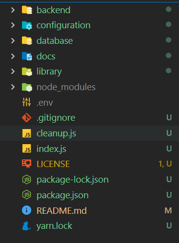
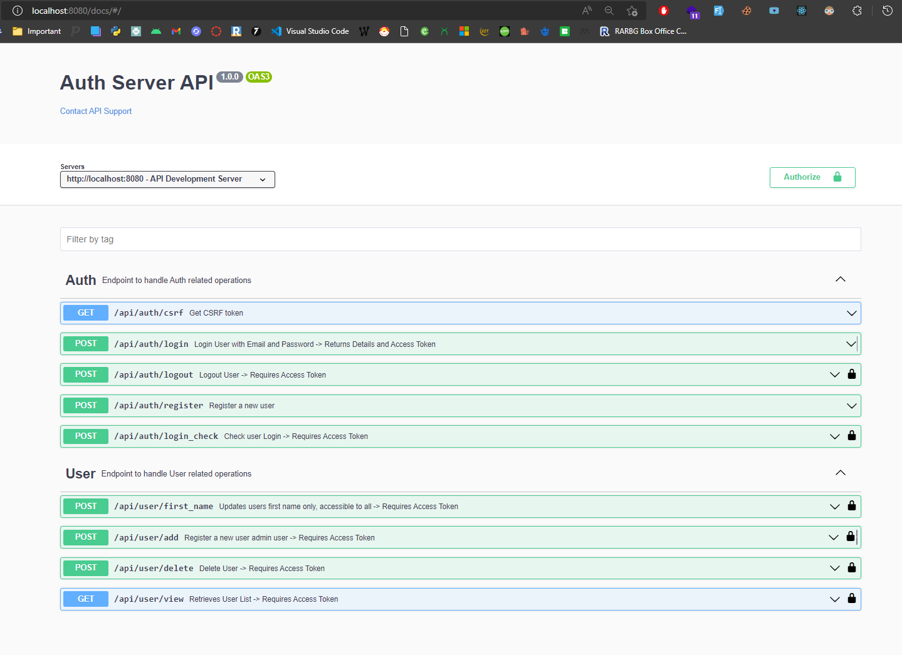

# AuthJs

         

## Table of Contents

- [AuthJs](#authjs)
  - [Table of Contents](#table-of-contents)
  - [Introduction](#introduction)
  - [Requirements](#requirements)
  - [Setup](#setup)
    - [Pre-Requisites](#pre-requisites)
    - [Assumptions](#assumptions)
    - [Suggestions](#suggestions)
    - [Instructions](#instructions)
    - [Directory Structure](#directory-structure)
  - [What is exposed](#what-is-exposed)
  - [Resolve PORT Conflict](#resolve-port-conflict)
    - [Ubuntu](#ubuntu)
    - [Windows](#windows)
  - [Support](#support)
  - [Issues](#issues)

## Introduction

This is a dummy project that helps you to start your frontend project and setup a basic authentication flow.

## Requirements

- [NodeJs](https://nodejs.org/en/) installed `v12.x.x` or higher.
- [Yarn](https://classic.yarnpkg.com/lang/en/docs/install) installed -> use  `yarn install --global yarn` if you want to setup yarn

Thats it for the requirements.

## Setup

Setting up project is relatively easy if you have `Node.js` installed in your pc.

1. Clone the repo or download the repo from [https://github.com/Sniper-Code/AuthJs](https://github.com/Sniper-Code/AuthJs)
2. Open terminal pointing to cloned directory and follow the [Instructions](#instructions) section.

### Pre-Requisites

1. Internet connection to download required packages.
1. [**Node.js version 12.x.x or higher. (v14+ recommended)**](https://nodejs.org/)
1. [**VisualStudio Code (VsCode) latest version.**](https://code.visualstudio.com/)

### Assumptions

I assume that the user has installed Node.js version 12.x.x or higher. (v14+ recommended) and the user has internet connection to download required packages. The user knows how to install  **Node.js** version 12.x.x or higher if not installed. The user also have basic knowledge of how to use **command line** and **VsCode**.

### Suggestions

Please use VisualStudio Code(VsCode) to have a better experience exploring files and all the   documents of the project. Open the "Readme.md" file in VsCode and use "ctrl+shift+v" command to have a better experience.

### Instructions

  To run the project open your command line interface (CLI) and navigate to the current directory and observe whether the `node_modules` folder is created. If not then run the following command:

```bash
  yarn setup
```

  This will install all the required _packages_. Now simply run another command to start the project:

``` bash
  yarn dev
```

You would see your browser opening URL `http://localhost:8080/docs`. If it does not check the terminal [CLI] which would show logs as shown in below.

```bash
Index: Working on Development Mode.
📡 Server is running in Development mode
🌎 Setting up HTTP Server
📚 Swagger Documentation is available at http://localhost:8080/docs/
📚 Swagger Documentation is available at http://localhost:8080/docs/
🛠 Configuring HTTP Routes
🔗 Establishing API Controller [Auth] at [/api/auth/] with E:/Practice/authJs/backend/controllers/api/Auth.js
Index: Working on Development Mode.
📡 Server is running in Development mode
Index: Working on Development Mode.
📡 Server is running in Development mode
🌎 Setting up HTTP Server
📚 Swagger Documentation is available at http://localhost:8080/docs/
📚 Swagger Documentation is available at http://localhost:8080/docs/
🛠 Configuring HTTP Routes
🔗 Establishing API Controller [Auth] at [/api/auth/] with E:/Practice/authJs/backend/controllers/api/Auth.js
🔗 Establishing API Controller [User] at [/api/user/] with E:/Practice/authJs/backend/controllers/api/User.js
👂 Connection Established, Serving HTTP with URL [http://localhost:8080]
```

Open your browser navigate to `http://localhost:8080/docs` URl and you are good to go.

### Directory Structure



1. [backend](./backend/) directory -> All the web/api controllers.
1. [configuration](./configuration/) directory -> All the Configurations.
1. [database](./database/) directory -> All the Scripts and Database files.
1. [documents](./documents/) directory -> All necessary images and documents.
1. [library](./library/) directory -> All custom written Codes
1. [node_modules](./node_modules/) -> All the packages and dependencies.

`index.js` file is the initial file that server requires whereas `cleanup.js` file is used to remove create a fresh setup of project wiping all information in database.

⚠️ Warning : Don't Run `yarn clean` or `yarn setup` unless you want a fresh setup.

## What is exposed

When you navigate to browser and open `http://localhost:8080/docs` you will see.


Every endpoints requires a csrf token which can be obtained from `http://localhost:8080/api/auth/csrf` and every user routs along with `login_check` routes requires **Authorization** header which can be achieved once you hit `http://localhost:8080/api/auth/login` route.

## Resolve PORT Conflict

When you see following message in console it means a PORT conflict has arise.

```bash
node:events:371
      throw er; // Unhandled 'error' event
      ^

Error: listen EADDRINUSE: address already in use :::8080
    at Server.setupListenHandle [as _listen2] (node:net:1319:16)
    at listenInCluster (node:net:1367:12)
    at Server.listen (node:net:1454:7)
    at Function.listen (F:\AuthJs\node_modules\express\lib\application.js:635:24)
    at Server.#listenHttp (F:\AuthJs\library\server\lib.server.express.js:418:14)
    at Server.setupHTTP (F:\AuthJs\library\server\lib.server.express.js:521:25)
    at Server.setUpServer (F:\AuthJs\library\server\lib.server.express.js:535:31)
    at Object.<anonymous> (F:\AuthJs\index.js:85:6)
    at Module._compile (node:internal/modules/cjs/loader:1101:14)
    at Object.Module._extensions..js (node:internal/modules/cjs/loader:1153:10)
Emitted 'error' event on Server instance at:
    at emitErrorNT (node:net:1346:8)
    at processTicksAndRejections (node:internal/process/task_queues:83:21) {
  code: 'EADDRINUSE',
  errno: -4091,
  syscall: 'listen',
  address: '::',
  port: 8080
}
```

To Fix this issue we have different solution as per the operating system.

### Ubuntu

Find PID using following command

```bash
lsof -i TCP:8080 | grep LISTEN
```

It would result in something like

```bash
node    2464 user   21u  IPv6 4392639      0t0  TCP *:http-alt
```

The Second colum after node is PID, kill the PID using following command

```bash
kill -9 2464
```

### Windows

Find the PID using following command

```bash
netstat -ano | findstr :8080
```

WHich would return something like

```bash
 TCP    0.0.0.0:8080           0.0.0.0:0              LISTENING       24552
 TCP    [::]:8080              [::]:0                 LISTENING       24552
```

Kill the PID at last after LISTENING using following command

```bash
taskkill /PID 24552 /F
```

## Support

If you have any issues please contact me at:

Email : [dibeshrsubedi@gmail.com](dibeshrsubedi@gmail.com)
LinkedIn : [https://www.linkedin.com/in/itsubedibesh](https://www.linkedin.com/in/itsubedibesh)

## Issues

Checkout [https://github.com/Sniper-Code/AuthJs/issues](https://github.com/Sniper-Code/AuthJs/issues) for any issues or to fill an issue.
